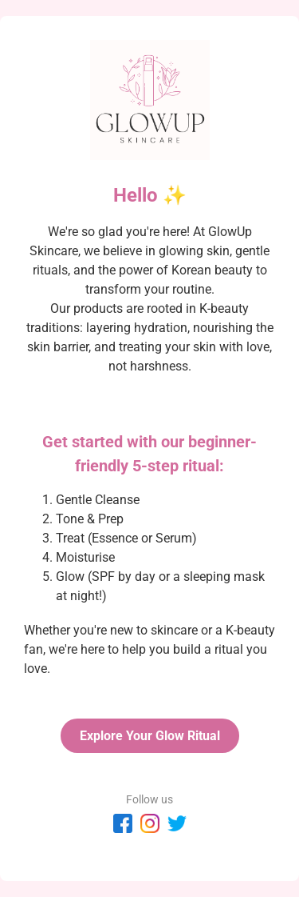
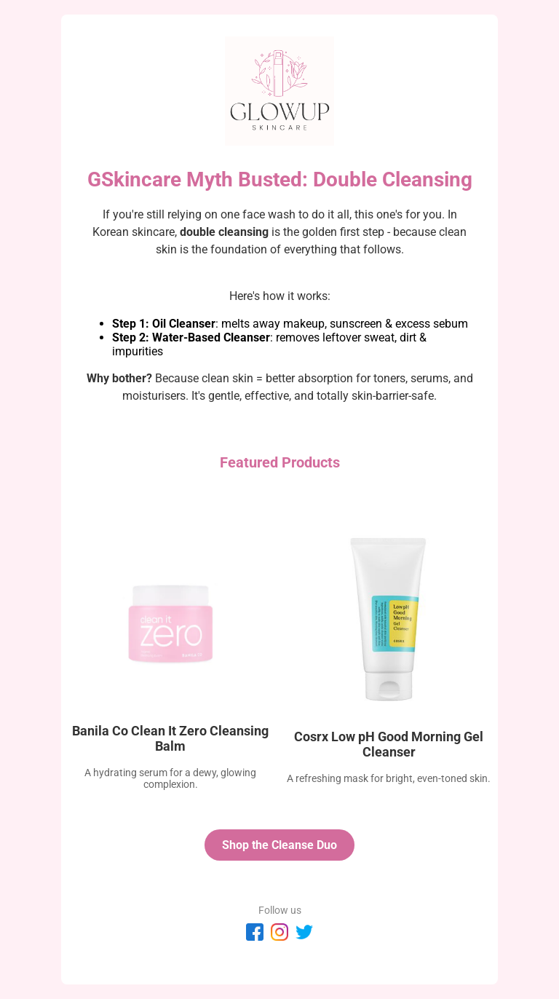
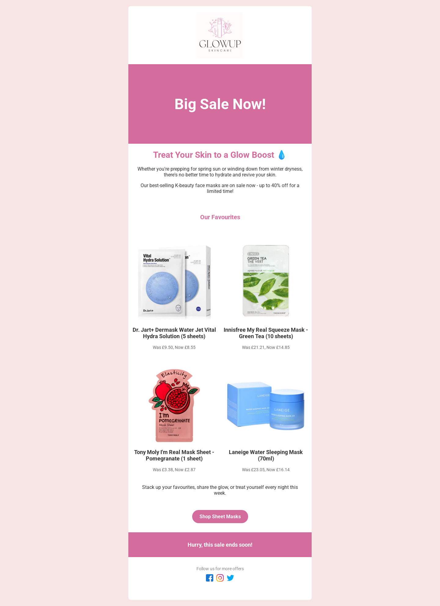
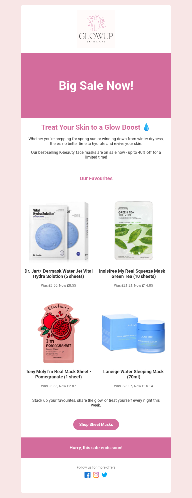

# GlowUp Skincare - K-Beauty Email Templates 💌

This project showcases three responsive, mobile-first HTML email templates for a fictional K-beauty brand, GlowUp Skincare. Designed to reflect a clean, modern skincare aesthetic and tested across devices.

## ✨ Templates Included

- **[Welcome Email](welcome-email/index.html)** - Intro to the brand and K-beauty skincare routine
- **[Newsletter](newsletter-email/index.html)** – Educational content on double cleansing
- **[Promo Email](promo-email/index.html)** – Face mask sale with real K-beauty products

## 💻 Tech & Best Practices

- Mobile-first, responsive design
- Table-based layout for email client compatibility
- Inline CSS styling
- Tested with Litmus

## 📸 Previews

### Welcome Email

| Desktop Preview                                                                                | Tablet Preview                                                                               | Mobile Preview                                                                               |
| ---------------------------------------------------------------------------------------------- | -------------------------------------------------------------------------------------------- | -------------------------------------------------------------------------------------------- |
|  |  |  |

### Newsletter Email

| Desktop Preview                                                                                      | Tablet Preview                                                                                     | Mobile Preview                                                                                     |
| ---------------------------------------------------------------------------------------------------- | -------------------------------------------------------------------------------------------------- | -------------------------------------------------------------------------------------------------- |
|  |  |  |

### Promo Email

| Desktop Preview                                                                            | Tablet Preview                                                                           | Mobile Preview                                                                           |
| ------------------------------------------------------------------------------------------ | ---------------------------------------------------------------------------------------- | ---------------------------------------------------------------------------------------- |
|  |  |  |

> 💡 _All screenshots were taken using real device testing or rendering tools for accurate preview._

## 🔗 Live Demo

You can view the full project hosted on GitHub Pages here:  
👉 **[Live Landing Page](https://desireealexia.github.io/glowup-email-templates/)**

Each email is viewable from that page or via the direct links above.

## 📁 How to View

Just clone this repo and open each `index.html` file in your browser.
